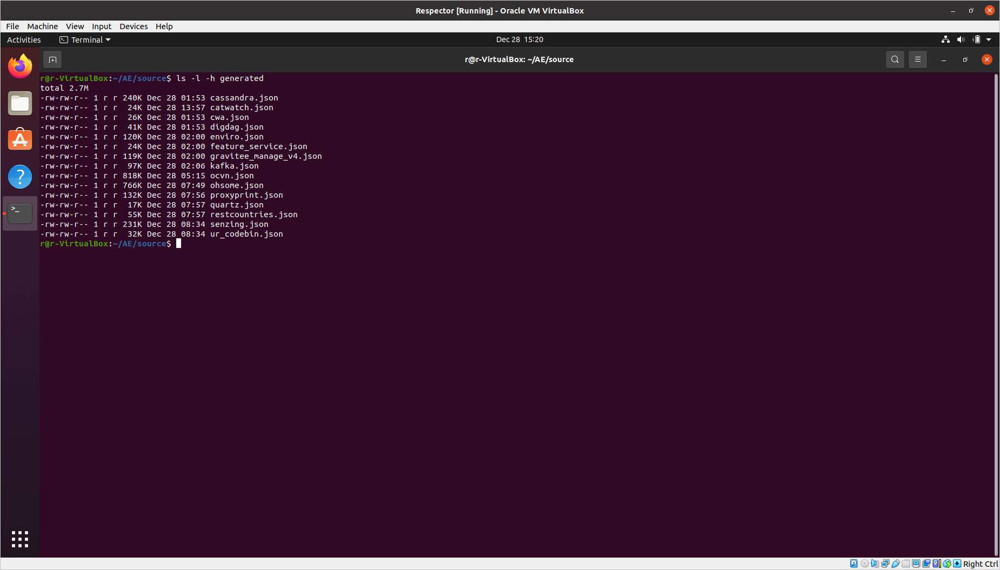
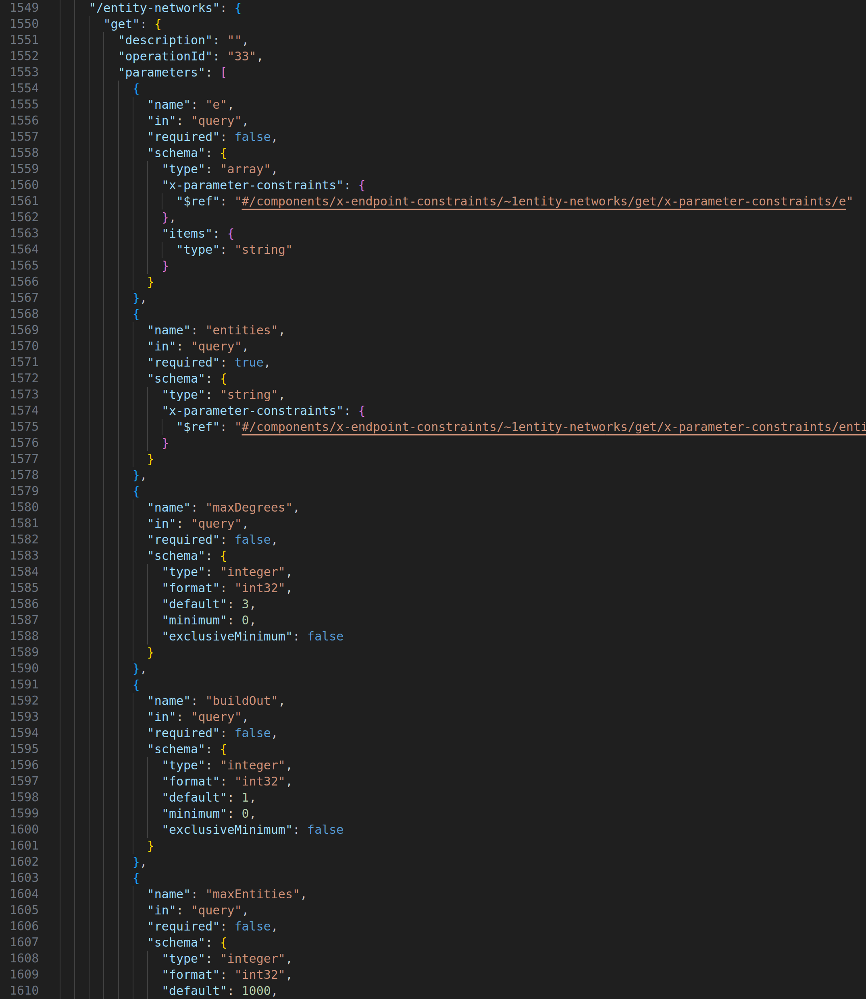
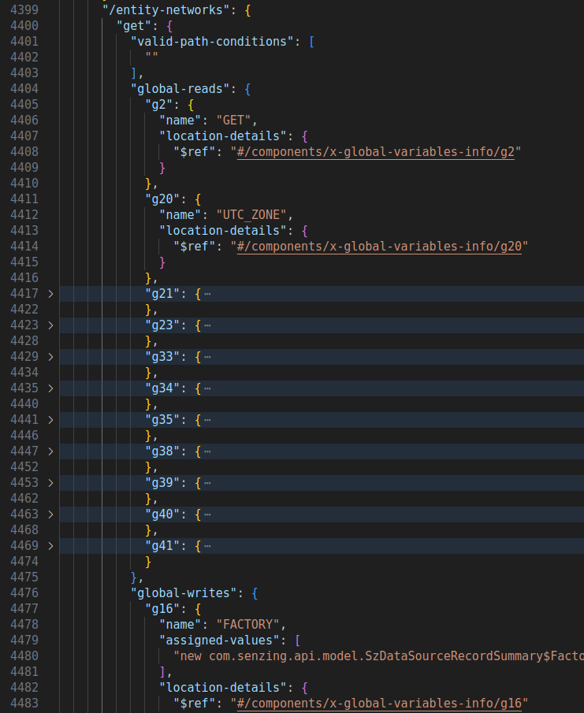
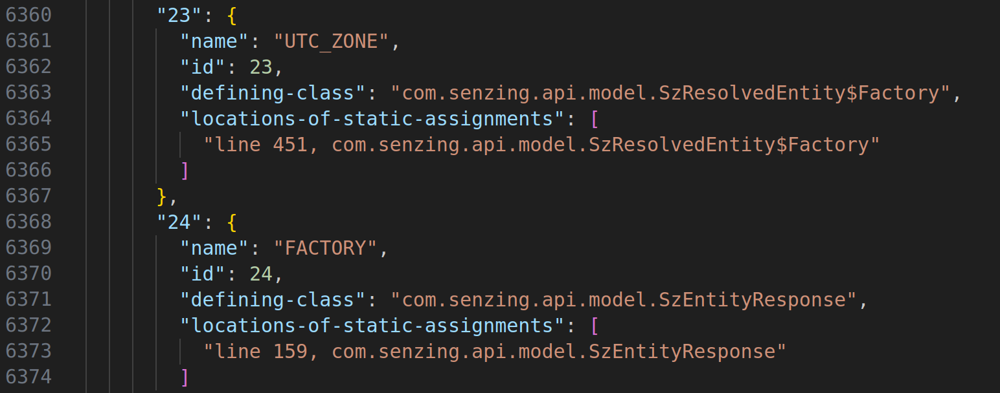
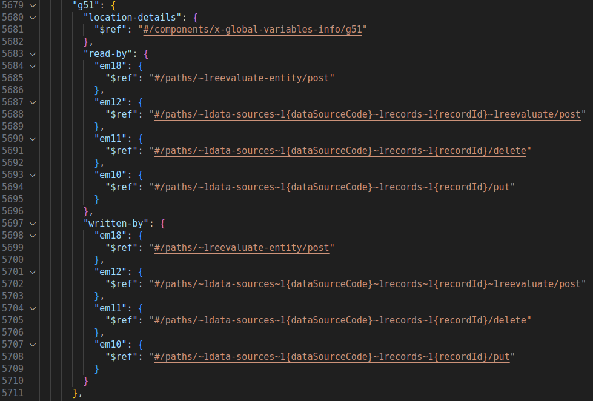

# Respector Replication Package (ICSE 2024)

This is the artifact of the paper ***Generating REST API Specifications through Static Analysis***, in Proceedings of the 46th International Conference on Software Engineering (ICSE), 2024 by Ruikai Huang, Manish Motwani, Idel Martinez and Alessandro Orso.

## Purpose

This artifact aims to facilitate the replication of the ICSE 2024 paper titled ***Generating REST API Specifications through Static Analysis***, and help researchers to build on the work.

This artifact includes the following:
1. Respector: implementation of the technique that employs static and symbolic analysis to generate specifications for REST APIs from their source code.
2. Evaluation of Respector on 15 real-world APIs.
3. Comparison of Respector with the developer-provided specifications.
4. Comparison of Respector with 4 state-of-the-art API specification generation techniques.
5. The databset of 15 APIs used in the evaluation.
6. Code to build Respector and execute it on the dataset to generate the results.

We are applying for the Artifacts Available and Artifacts Reusable badges. 
We believe our artifact deserves the Artifacts Available badge because we make all the materials used to implement and replicate our study available on a publicly accessible archival repository.
We believe our artifact deserves the Artifacts Reusable badge because the materials we make available in our artifact can be reused by researchers and practitioners in various ways -- either to replicate our results or to augment or improve their own studies and technologies.

## Provenance

This replication package, including all the above listed artifacts, is available on GitHub and then achieved on Software Heritage, along with a copy of the paper's prepint. 

[Software Heritage Repo](https://archive.softwareheritage.org/browse/origin/https://github.com/nntzuekai/Respector)

[GitHub Repo](https://github.com/nntzuekai/Respector)

Additionally, we also created a VirtualBox VM image of a working environment of the artifacts, which is available on Zenodo: `Respector.ova`. To facilitate installing Respector locally, our Zenodo upload also includes a pre-built copy of the version of Z3 that we used for Respector: `z3.zip`.

[Zenodo Upload](https://zenodo.org/doi/10.5281/zenodo.10429765)

<!-- # Data -->

## Setup

You can either load our VM image to use the artifact directly, or set it up locally. We recommend the former.

### Install Locally

Please follow the instructions in `/source/README.md` for installing Respector locally on your host machine.

### Use the VM

Note: The virtual machine was created and tested using VirtualBox version 6.1 on Ubuntu 20.04. Make sure you have atleast 40 GB of free storage to download and execute the virtual machine.

1. Download and install VirtualBox.
2. Download virtual machine image [Respector.ova](https://zenodo.org/doi/10.5281/zenodo.10429765). Please note this is a large file (12.6 GB) and may take some time (~15 min, depending on your Internet) to download.
3. Open VirtualBox.
4. Go to `File` > `Import Appliance...`.
5. Find and select the downloaded virtual machine file `Respector.ova`. Click `Continue`.
6. Click `Agree` in the Software License Agreement box.
7. Leave all the settings as they are and click `Import`. (This will take around 6-10 minutes.)

Once the virtual machine is imported, it will appear in your VirtualBox Manager as `Respector` as shown below.


You can now start the virtual machine by clicking the green `Start` arrow at the top of the VirtualBox Manager (see screenshot above).

When the machine boots up successfully you will see the screen as shown below.


#### Username and Password

Use the username `r` and password `12345` if you need to login or obtain the `sudo` privilege.

## Usage

Open a termial window, change the working directory to `/home/r/AE` (referred as `AE` below), and use `ls` command to confirm that folders `source`, `dataset` and `results` are in the directory:

```
cd /home/r/AE
ls
```


### Example Use

All the artifacts in the VM image have already been built and are ready for reproducing results. 

To test if Respector is operational, you can run Respector on `restcountries` API to generate the specification. Under `AE` folder, execute the following commands.

```
cd source
bash ./scripts/run_respector.sh ../dataset/restcountries/target/classes/ ./generated/restcountries.json
```

This will take around 15 seconds to finish. While executing, Respector will print out how many endpoints it has processed:


Once it is done, you can find the generated OAS at `./generated/restcountries.json`.


### Replicate the results

To run Respector on all the 15 APIs in the dataset, execute the following command under `AE/source` folder.

***NOTE: This will take 7 hours in total.***

```
bash ./scripts/run_all.sh ./generated/ ../dataset/
```

Respector will create generated specifications under `./generated` folder while logs are saved in `./logs`. We attached pre-computed results in `./generated_0/` folder. 



***If you see your generated specification different from what we attacthed***: Usually that is a different ordering of endpoint methods and global variables, which depends on how Soot loads the class files. It is normal to have such differences if you have recompiled the target classes. If you see a different order, you can check the total number of lines in the generated specification. If it is the same as the total number of lines in the specification we attached, then it is just the ordering issue. You can use `./scripts/cmp_lines.sh` to compare the numbers of lines of files between two folders:

```
bash ./scripts/cmp_lines.sh ./generated ./generated_0
```

#### Evaluation

The evaluation results are stored in `AE/results`. This directory has three subfolders corresponding to the three research questions in the paper, each of which contains results from our analysis and the OpenAPI specifications used for the analysis.

1. **RQ1: Can Respector generate accurate specifications?**

Under the folder `RQ1`, the folder `Respector-Generated-Spec` contains the OpenAPI 3.0 specifications in JSON format of the 15 APIs in the dataset folder.

The spreadsheet `RQ1_results.xlsx` contains the raw data of results for the 15 APIs, with each tab corresponding to an API. In each tab, endpoint methods, parameters, constraints and responses are listed. The `GT` column indicates if the entity belongs to the ground truth we constructed with manual analysis, the `Respector` column indicates if the entity is detected by Respector, and the `correct` column indicates if the entity is corrected detected (i.e., GT==1 and Respector==1). Finally, on the rightmost side there is the summary of the precision and recall numbers for extracting endpoint methods, parameters, constraints and responses.

2. **RQ2: How do Respector-generated specifications compare with developer-provided specifications?**

The folder `Respector-Generated-Spec` contains the OpenAPI 3.0 specifications in JSON format generated by Respector for the 15 APIs in the dataset folder.

The folder `Developer-Provided-Spec` contains the OpenAPI 3.0 specifications in JSON format provided by the API developers of the 15 APIs in the dataset folder.

The spreadsheet `RQ2_results.xlsx` contains the raw data of results for the 15 APIs, with each tab corresponding to an API. In each tab, endpoint methods, parameters, constraints, and responses detected by Respector are listed, and the `Detected in developer OAS` column indicates if the entity is present in the developer-provided specification. The summary cells on the right side compute the total counts of the entities and the detected entities.

3. **RQ3: How does Respector compare with alternative state-of-the-art API specification generation techniques?**

The folder `Respector-Generated-Spec` contains the OpenAPI 3.0 specifications in JSON format generated by Respector for the 15 APIs in the dataset folder.

The folder `Technique-Generated-Spec` contains the OpenAPI 3.0 specifications in JSON format generated by four existing techniques organized in different subfolders for the 15 APIs in the dataset folder.

The spreadsheet `RQ3_results.xlsx` contains the raw data of results for the 15 APIs, with each tab corresponding to an API. In each tab, endpoint methods, parameters, constraints, and responses detected by Respector are listed. The columns `Detected in AppMap OAS`, `Detected in Swagger Core OAS`, `Detected in springdoc-openapi OAS` and `Detected in SpringFox OAS` show if the entity is also detected by AppMap, Swagger Core, springdoc-openapi and SpringFox, respectively. Columns are left empty if (1) the corresponding technique is not applicable for the API, (2) it failed to generate a specification, (3) or it cannot generate the entities of that type by design.


### Compile Respector

Respector is **already compiled** in the VM image. If you wish to recompile it, execute the following command under `AE/source` folder.

```
mvn package
```

The complied Jar of Respector would be available in target folder (`target/Respector-0.1-SNAPSHOT.jar`).

### Compile APIs in the dataset

The APIs in the dataset are **already compiled** in the VM image. If you wish to recompile them, execute the following command under `AE/dataset` folder.

***NOTE: It will take around 1 hour to compile all 15 APIs.***

```
bash clean_all.sh
bash build_all.sh
```

### Run Respector on an API

You need to first build the API. For example, for the `Senzing` API described in the paper, execute the following command under `AE/dataset/senzing-api-server`.

```
mvn compile
```

The compiled class files would be under `AE/dataset/senzing-api-server/target/classes/`

To run Respector on the API, execute the following command under `AE/source` directory:

<pre><code>bash ./scripts/run_respector.sh &lt;path to API class files&gt;...  &lt;path to the generated OAS&gt;</code></pre>

`<path to API class files>`: You can provide one or more directories containing relevant class files of the API, including class files of the libraries it uses. You can specify multiple paths as different arguments. The last argument is considered as the path to output the generated specification.

For `Senzing` API, that would be:

```
bash ./scripts/run_respector.sh ../dataset/senzing-api-server/target/classes ./generated/senzing.json
```

It will take around 30 minutes to finish. Once it is done, you can find the generated OAS at `./generated/senzing.json`.

The endpoint method we use in the motivating example in the paper, `GET /entity-networks` can be found on line 1549:



Its enhanced OAS can be found on line 4399:



`x-global-variables-info` section is from line 6307 on:



`x-endpoint-interdependence` section starts from line 5679:

