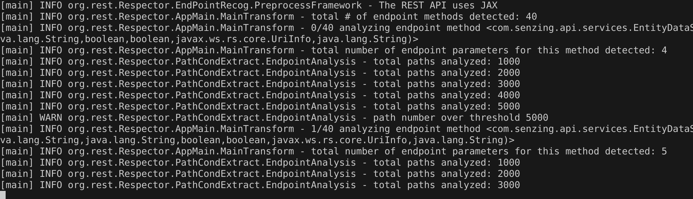

# Dependencies

- Install Java 11.
- Install Z3 (following pre-built Z3 instruction below)

## Pre-built Z3

For your convenience, we attached the pre-built binary of the version of Z3 we used for Respector. You can decompress `z3.zip` under this folder and the root directory of the extracted folder as `Z3_HOME` to other scripts.

This binary of Z3 was built on Ubuntu 20.04 on AMD64 machine with Java 11.

## Download and install Z3

Clone Z3 from https://github.com/Z3Prover/z3

We used the version of Z3 with commit ID `23c53c6820b2d0c786dc416dab9a50473a7bbde3`.

Inside the folder of cloned Z3, execute:


```
git checkout 23c53c6820b2d0c786dc416dab9a50473a7bbde3
python scripts/mk_make.py --java
cd build
make
export Z3_HOME=<path to the clone repo>
```

# How to compile Respector?

1. Specify the path to the Java binding of `Z3` on line 51 in pom.xml. You are supposed to provide `Z3_HOME/build/com.microsoft.z3.jar` as the `<systemPath>` to the Maven dependency of `Z3`.

2. You might have installed some version of Soot in your Maven local repo. Try to delete folder `~/.m2/repository/org/soot-oss/`, otherwise it is using the Soot there instead of the version we provided in `./lib/local_repo/`.

3. Compile and package the project by
   ```
   mvn package
   ```

The complied Jar of Respector would be available in target folder. (Pre-compiled Respector exists at `target/Respector-0.1-SNAPSHOT.jar`)

# How to run Respector?

1. Following the instructions in the README file under the dataset folder, compile the APIs you want to evaluate on:

   E.g.,

   ```
   cd ../dataset/restcountries/
   mvn compile
   ```

2. To run Respector on an API, use script `run_respector.sh` under `scripts` folder:

   ```
   bash ./scripts/run_respector.sh <Z3_HOME> [<path to API class files>] ...  <path to the generated OAS>
   ```

   `<path to API class files>`: You can provide one or more directories containing relevant class files of the API, including class files of the libraries it uses. You can specify multiple paths as different arguments. The last argument is considered as the path to output the generated specification.


3. Alternatively, to run Respector on all the 15 APIs in the dataset:
   
   Execute `run_all.sh` in `scripts` folder.

   ***NOTE: This will take 5.5 hours in total.***

   ```
   bash ./scripts/run_all.sh ./generated/ <Z3_HOME> ../dataset/
   ```

We have attached the generated specifications in `./generated/` folder. 

***If you see your generated specification different from what we attacthed***: Usually that is a different ordering of endpoint methods and global variables, which depends on how Soot loads the class files. It is normal to have such differences when you are using a different Soot version (which should be avoided) or if you have recompiled the target classes. When you see the numbers are different, you can check the total number of lines in the generated specification. If it is the same as the total number of lines in the specification we attached, then it is just the ordering issue.

# Example Use

Here we show the steps of running Respector on Senzing API to generate OpenAPI specifications as described in the paper.

First, please compile the target API with its proper Java commonds.

   Under `../dataset/senzing-api-server`:

   ```
   mvn compile
   ```

The compiled class files would be under `../dataset/senzing-api-server/target/classes`

Run Respector on these class files:

   ```
   bash ./scripts/run_respector.sh <Z3_HOME> ../dataset/senzing-api-server/target/classes ./generated/senzing.json
   ```

It will take around 30 minutes to finish. While executing, Respector will print out how many endpoints it has processed:



Once it is done, you can find the generated OAS at `./generated/senzing.json`.

The endpoint method we use in the motivating example in the paper, `GET /entity-networks` can be found on line 1549:


Its enhanced OAS can be found on line 4399:


`x-global-variables-info` section is from line 6178 on:


`x-endpoint-interdependence` section starts from line 5309:


